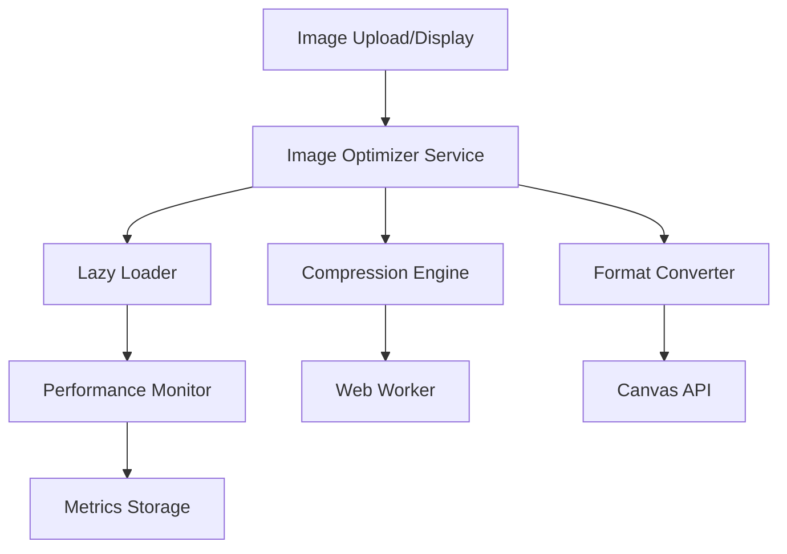

# Design Document: Frontend Image Optimization

## Overview

The frontend image optimization system provides comprehensive client-side image processing for the SwiftCart React application. The system implements automatic compression, lazy loading, and modern format conversion to optimize performance and user experience without requiring backend changes.

## Architecture

The system follows a modular architecture with three core services:



## Components and Interfaces

### Image Optimizer Service
Central orchestrator that coordinates all image optimization operations.

```typescript
interface ImageOptimizerService {
  compressImage(file: File, options: CompressionOptions): Promise<File>
  convertFormat(file: File, targetFormat: 'webp' | 'avif'): Promise<File>
  optimizeForDisplay(src: string, options: DisplayOptions): Promise<string>
}

interface CompressionOptions {
  maxSizeMB: number
  maxWidthOrHeight: number
  quality: number
  useWebWorker: boolean
}
```

### Lazy Loader Component
React component that handles deferred image loading with intersection observer.

```typescript
interface LazyImageProps {
  src: string
  alt: string
  width?: number
  height?: number
  priority?: boolean
  onLoad?: () => void
  onError?: (error: Error) => void
}

interface LazyLoaderConfig {
  rootMargin: string
  threshold: number
  retryAttempts: number
  retryDelay: number
}
```

### Format Converter
Handles modern format conversion using Canvas API.

```typescript
interface FormatConverter {
  supportsWebP(): boolean
  supportsAVIF(): boolean
  convertToWebP(file: File, quality: number): Promise<File>
  convertToAVIF(file: File, quality: number): Promise<File>
  getBestFormat(): 'avif' | 'webp' | 'jpeg'
}
```

### Performance Monitor
Tracks and reports image loading metrics.

```typescript
interface PerformanceMetrics {
  loadTime: number
  fileSize: number
  compressionRatio: number
  format: string
  cacheHit: boolean
}

interface PerformanceMonitor {
  trackImageLoad(metrics: PerformanceMetrics): void
  getAverageLoadTime(): number
  getBandwidthEstimate(): number
}
```

## Data Models

### Image Metadata
```typescript
interface ImageMetadata {
  originalSize: number
  compressedSize: number
  dimensions: { width: number; height: number }
  format: string
  quality: number
  compressionRatio: number
  loadTime?: number
}
```

### Optimization Settings
```typescript
interface OptimizationSettings {
  compression: {
    maxSizeMB: number
    quality: number
    maxDimensions: number
  }
  lazyLoading: {
    rootMargin: string
    threshold: number
    enabled: boolean
  }
  formats: {
    preferAVIF: boolean
    preferWebP: boolean
    fallbackQuality: number
  }
}
```

## Correctness Properties

*A property is a characteristic or behavior that should hold true across all valid executions of a system-essentially, a formal statement about what the system should do. Properties serve as the bridge between human-readable specifications and machine-verifiable correctness guarantees.*

### Property 1: Compression Size Limit
*For any* image file processed by the compression engine, the output file size should not exceed the specified maxSizeMB limit
**Validates: Requirements 1.1**

### Property 2: Quality Preservation
*For any* compressed image, the visual quality should maintain at least 85% similarity to the original
**Validates: Requirements 1.2**

### Property 3: Dimension Constraints
*For any* image exceeding maximum dimensions, the resized output should maintain aspect ratio and fit within specified bounds
**Validates: Requirements 1.3**

### Property 4: Non-blocking Compression
*For any* compression operation, the main UI thread should remain responsive and not be blocked
**Validates: Requirements 1.4**

### Property 5: Lazy Loading Behavior
*For any* image, loading should be deferred when below viewport and triggered when entering the intersection threshold
**Validates: Requirements 2.1, 2.2**

### Property 6: Priority Loading
*For any* above-fold image, loading should begin immediately with higher priority than below-fold images
**Validates: Requirements 2.5, 4.3**

### Property 7: Format Selection Hierarchy
*For any* browser environment, the format converter should serve the best supported format in preference order: AVIF → WebP → JPEG/PNG
**Validates: Requirements 3.1, 3.2, 3.3**

### Property 8: Quality Control
*For any* format conversion, the compression quality should be maintained within 60-65% range
**Validates: Requirements 3.4**

### Property 9: Performance Metrics Collection
*For any* image load event, loading times and file sizes should be tracked and recorded
**Validates: Requirements 4.1**

### Property 10: Adaptive Quality
*For any* bandwidth-limited scenario, image quality should be automatically reduced to maintain performance
**Validates: Requirements 4.2**

### Property 11: Cache-First Loading
*For any* previously cached image, the system should serve from browser cache before making network requests
**Validates: Requirements 4.4**

### Property 12: UI State Management
*For any* image loading state, appropriate visual feedback should be displayed (skeleton → content → error state with retry)
**Validates: Requirements 5.1, 5.2, 5.3**

### Property 13: Interactive Preloading
*For any* interactive image, hovering should trigger preloading for instant response
**Validates: Requirements 5.5**

### Property 14: Comprehensive Error Recovery
*For any* failed image operation (compression, conversion, loading), the system should fallback gracefully with appropriate user feedback
**Validates: Requirements 1.5, 2.4, 3.5**

## Error Handling

### Compression Failures
- Fallback to original image with user notification
- Log compression errors for debugging
- Retry with reduced quality settings

### Loading Failures
- Exponential backoff retry mechanism
- Display error state with manual retry option
- Fallback to placeholder image after max retries

### Format Conversion Failures
- Automatic fallback to original format
- Browser compatibility detection
- Graceful degradation for unsupported formats

## Testing Strategy

### Unit Tests
- Test individual service methods with specific inputs
- Verify error handling and edge cases
- Test browser compatibility detection
- Validate configuration parsing and defaults

### Property-Based Tests
- Test compression with randomly generated images and settings
- Verify lazy loading behavior across different viewport scenarios
- Test format conversion with various image types and qualities
- Validate performance metrics accuracy across different conditions

**Testing Configuration:**
- Use fast-check library for property-based testing
- Minimum 100 iterations per property test
- Each property test tagged with: **Feature: frontend-image-optimization, Property {number}: {property_text}**
- Mock Canvas API and IntersectionObserver for consistent testing
- Use synthetic image data for reproducible test results